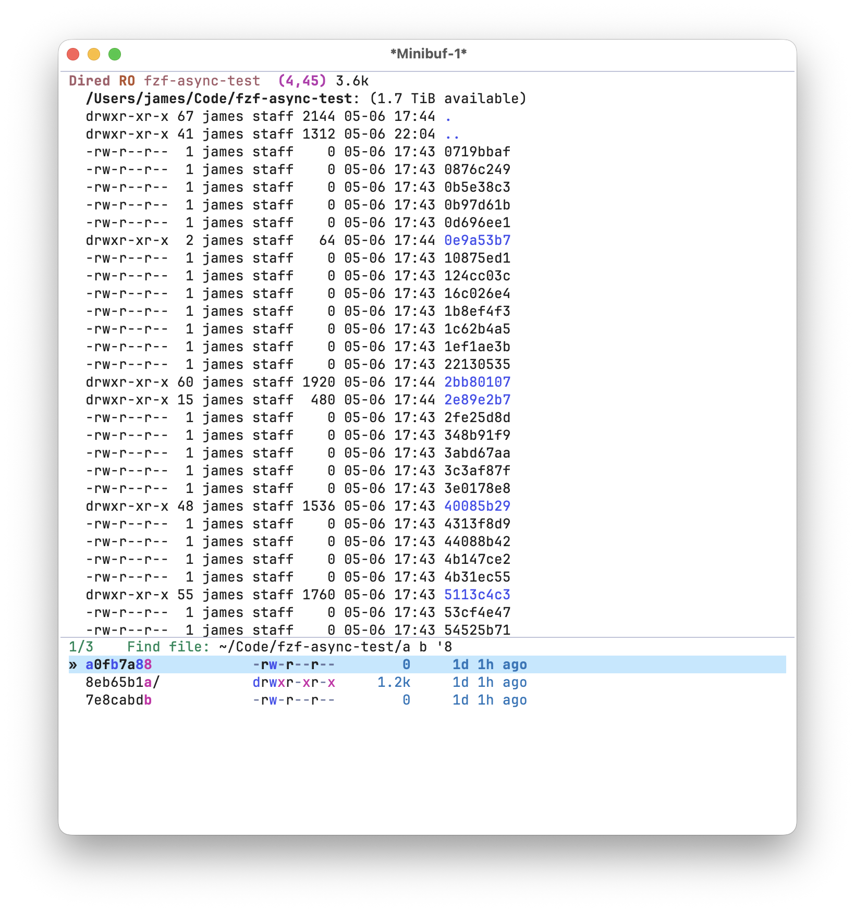

#+TITLE: fzf-async
#+STARTUP: noindent

[[./screenshots/demo.gif]]

This package provides async fuzzy completion for Emacs backed by
[[https://github.com/dangduc/fzf-native][fzf-native]].
A shell command streams candidates into a background reader thread;
[[https://github.com/junegunn/fzf][fzf]] scores and sorts them in parallel
across all available CPU cores; results land in a standard ~completing-read~
UI incrementally as the shell command is still running.

It is designed for candidate sets too large for synchronous completion —
hundreds of thousands to millions of files or lines — where other solutions
are too slow or don't match candidates fuzzily.

* Why

Existing async completion packages share a fundamental design problem: the
user's query string is consumed in *two separate stages* by two different
matching algorithms.

Take ~consult-ripgrep~ as an example. The query is first passed directly to
~rg~ as a pattern, narrowing the candidate pool at the shell level.  The
survivors are then handed back to Emacs where the active ~completion-style~
rescores and re-sorts them.  Those two stages may use incompatible matching
semantics: ~rg~ applies regex or literal matching while the completion style
applies its own fuzzy or flex logic.

e.g. [[https://github.com/minad/consult#asynchronous-search][consult: asynchronous search]]

~fzf-async~ eliminates the two-stage problem entirely. The shell command runs
*without a query* and emits candidates unconditionally. The user's query is
given *only* to fzf, which handles both filtering and scoring in a single,
coherent pass.

This is equivalent to calling ~fzf~ directly in the shell.

** The fzf algorithm

fzf uses a modified Smith-Waterman sequence alignment algorithm.  Every
character of the query must appear in the candidate in order, but not
necessarily consecutively — standard fuzzy matching.  Bonus points are
awarded for matching at word boundaries, path component separators, and
camelCase transitions, which causes semantically better matches to rank
higher than incidental character matches.

Scores are bounded non-negative integers (typically 0–10 000), which makes
radix-style counting sort feasible and avoids the O(n log n) overhead of
comparison sort for large candidate sets.

- [[https://github.com/junegunn/fzf][fzf]] — original fzf written in Go
- [[https://github.com/nvim-telescope/telescope-fzf-native.nvim][telescope-fzf-native.nvim]]
  — C port of fzf
- [[https://github.com/dangduc/fzf-native][fzf-native]] — Emacs wrapper

** Multi-component filtering

Queries may contain multiple space-separated terms.
This mirrors the fzf command-line search syntax:

| Syntax          | Meaning                                  |
|-----------------+------------------------------------------|
| ~foo bar~       | fuzzy-match both ~foo~ and ~bar~         |
| ~'foo~          | exact substring match for ~foo~          |
| ~^foo~          | prefix match for ~foo~                   |
| ~foo$~          | suffix match for ~foo~                   |
| ~!foo~          | exclude candidates matching ~foo~        |
| ~foo \vert bar~ | OR: match ~foo~ or ~bar~                 |

For example, typing ~el$ !test~ finds files ending in ~.el~ that do not
contain ~test~.

Refer to the full query syntax:
[[https://github.com/nvim-telescope/telescope-fzf-native.nvim#telescope-fzf-nativenvim][telescope-fzf-native query syntax]]

** Multithreaded scoring

Scoring is performed by
[[https://github.com/dangduc/fzf-native][fzf-native]],
a C dynamic module that spawns multiple worker threads to split up the work.

Both ~fussy~ and ~fzf-async~ are multithreaded at the C layer.  With ~fussy~,
Emacs blocks until the full candidate list is scored and returned — suitable
for in-memory lists.  ~fzf-async~ runs the shell command in a background
process and incrementally refreshes the completion UI as candidates arrive
and are scored.

* Installation

Dependencies:

~fzf-native~

Main Repo:

#+begin_src emacs-lisp :tangle yes
  (use-package fzf-native
    :vc (:url "https://github.com/dangduc/fzf-native")
    :config
    (fzf-native-load-dyn))
#+end_src

Fork: (Might have to use this for now.)

#+begin_src emacs-lisp :tangle yes
  (use-package fzf-native
    :vc (:url "https://github.com/jojojames/fzf-native")
    :config
    (fzf-native-load-dyn))
#+end_src

Minimal setup:

#+begin_src emacs-lisp :tangle yes
  (use-package fzf-async
    :vc (:url "https://github.com/jojojames/fzf-async")
    :config
    (fzf-async-setup))
#+end_src

Recommended:

#+begin_src emacs-lisp :tangle yes
  (use-package fzf-native
    :vc (:url "https://github.com/dangduc/fzf-native")
    ;; OR :vc (:url "https://github.com/jojojames/fzf-native")
    :config
    (fzf-native-load-dyn))

  (use-package fussy
    :vc (:url "https://github.com/jojojames/fussy")
    :config
    (fussy-setup-fzf)
    (fussy-eglot-setup)
    (fussy-company-setup))

  (use-package fzf-async
    :vc (:url "https://github.com/jojojames/fzf-async")
    :config
    (fzf-async-setup))
#+end_src

This sets up a consistent ~completing-read~ and ~completion-in-region~
experience using ~fzf~ as the core filtering/scoring algorithm.

* Quick Start

#+begin_src emacs-lisp :tangle yes
  ;; Register the completion style.
  (fzf-async-setup)

  ;; Then call any command:
  (fzf-async-git-ls-files)
  (fzf-async-rg)
  (fzf-async-fd)
  (fzf-async-find)
#+end_src

* Commands

All commands open the selected candidate in Emacs.

** File finders

| ~fzf-async~                | ~counsel~           | ~consult~               |
|----------------------------+---------------------+-------------------------|
| ~fzf-async-find~           | ~counsel-find-file~ | ~consult-find~          |
| ~fzf-async-fd~             | —                   | ~consult-fd~            |
| ~fzf-async-rg-files~       | —                   | ~consult-find~          |
| ~fzf-async-ag-files~       | —                   | —                       |
| ~fzf-async-git-ls-files~   | ~counsel-git~       | —                       |
| ~fzf-async-hg-files~       | —                   | —                       |
| ~fzf-async-recent-file~    | ~counsel-recentf~   | ~consult-recent-file~   |
| ~fzf-async-locate~         | ~counsel-locate~    | ~consult-locate~        |
| ~fzf-async-spotlight~      | —                   | —                       |
| ~fzf-async-spotlight-apps~ | —                   | —                       |

** Emacs based

| ~fzf-async~             | ~counsel~              | ~consult~           |
|-------------------------+------------------------+---------------------|
| ~fzf-async-buffer~      | ~ivy-switch-buffer~    | ~consult-buffer~    |
| ~fzf-async-bookmark~    | ~counsel-bookmark~     | ~consult-bookmark~  |

** Content search

Grep-style commands parse ~FILE:LINE:CONTENT~ output and jump directly to
the matching line.

| ~fzf-async~                   | ~counsel~ / ~ivy~  | ~consult~            |
|-------------------------------+--------------------+----------------------|
| ~fzf-async-rg~                | ~counsel-rg~       | ~consult-ripgrep~    |
| ~fzf-async-ag~                | ~counsel-ag~       | —                    |
| ~fzf-async-git-grep~          | ~counsel-git-grep~ | ~consult-git-grep~   |
| ~fzf-async-grep~              | ~counsel-grep~     | ~consult-grep~       |
| ~fzf-async-grep-current-file~ | ~counsel-grep~     | ~consult-line~       |
| ~fzf-async-ugrep~             | —                  | —                    |
| ~fzf-async-swiper~            | ~swiper~           | ~consult-line~       |
| ~fzf-async-swiper-all~        | ~swiper-all~       | ~consult-line-multi~ |

* Completion style compatibility

~fzf-async~ registers and uses its own ~completion-style~ named ~fzf-async~.
This style is only a passthrough: it accepts the query string as-is and forwards
it directly to the ~fzf~ scoring layer without applying any transformation.

*This style must not be added to the global ~completion-styles~ list.*
Doing so applies it to every ~completing-read~ in the session, including
callers that pass a plain list or hash-table as the collection, which will
trigger an error.  ~fzf-async-setup~ wires the style correctly via
~completion-category-overrides~ for the ~fzf-async~ category only.  Other
~completion-styles~ packages (e.g. ~orderless~, ~hotfuzz~) may override
this.

Do not set ~fzf-async~ as a fallback in ~completion-styles~.  Do not combine
it with ~orderless~, ~fussy~, ~flex~, or any other style for the ~fzf-async~
category — the results are already scored and sorted by fzf; re-filtering
by another style corrupts the ranking.

* Companion package — fussy

The recommended companion package is
[[https://github.com/jojojames/fussy][fussy]],
for general ~completing-read~ and ~completion-at-point~ (e.g. code
completion).  Both ~fussy~ and ~fzf-async~ are backed by the same
[[https://github.com/dangduc/fzf-native][fzf-native]]
module, giving you consistent fuzzy matching semantics with ~fzf~ across
both synchronous and asynchronous contexts.

~fussy~ operates synchronously on in-memory candidate lists and integrates
with ~company~, ~corfu~, ~eglot~, and all standard ~completing-read~
frontends.  ~fzf-async~ handles the case where candidates come from a shell
command (e.g. ~find~ or ~ripgrep~) and must be streamed incrementally.

#+begin_src emacs-lisp :tangle yes
  (use-package fzf-native
    :vc (:url "https://github.com/dangduc/fzf-native")
    :config
    (fzf-native-load-dyn))

  ;; Synchronous fuzzy completion for code, buffers, M-x, etc.
  (use-package fussy
    :vc (:url "https://github.com/jojojames/fussy")
    :config
    (fussy-setup-fzf)
    (fussy-eglot-setup)
    (fussy-company-setup))

  ;; Async fuzzy completion for large file/grep searches.
  (use-package fzf-async
    :vc (:url "https://github.com/jojojames/fzf-async")
    :config
    (fzf-async-setup))
#+end_src

* Integrations

~fzf-async~ works through the standard Emacs ~completing-read~ API and is
compatible with any frontend that calls the completion table function on
each input change.

| Frontend      | Status    | Notes                                                          |
|---------------+-----------+----------------------------------------------------------------|
| ~vertico~     | Full      | Recommended.  Generation-based refresh via ~vertico--exhibit~. |
| ~icomplete~   | Full      | Refreshes via ~icomplete-exhibit~.                             |
| ~fido~        | Full      | Built on ~icomplete~; works without extra configuration.       |
| ~ivy/counsel~ | Supported | Push model via ~ivy--set-candidates~. See below.               |

Caveat: I mostly use ~vertico~ these days so wasn't exhaustive with using the
other completion systems.
** transient
A [[https://github.com/jojojames/matcha/blob/master/matcha-fzf-async.el][matcha transient]] is
 defined for invoking all ~fzf-async~ commands from a
single keybinding via [[https://github.com/jojojames/matcha][matcha]].
** ivy / counsel

Ivy uses a *push model*: the completion UI holds its own internal candidate
list (~ivy--all-candidates~) and does not re-call the collection function
on each display refresh.  This conflicts with ~fzf-async~'s pull model,
where vertico re-calls our collection lambda to get fresh scored results.

~fzf-async~ handles this with a dedicated push path.  The polling timer
calls ~fzf-native-async-candidates~ directly, pushes the results via
~ivy--set-candidates~, and redraws via ~ivy--exhibit~ — the same approach
used by counsel's async commands.  The stats prompt (directory, selection
index, filtered/total counts) is delivered via ~ivy-pre-prompt-function~,
which ivy prepends to the prompt string on each redraw.

*Highlighting caveat:* match highlighting does not work perfectly *yet* with ivy.
Ivy bypasses ~completion-styles~ entirely and does not call the
~all-completions~ function where ~fzf-async~ applies face properties to
matched characters.

Help appreciated.

* Customization

| Variable                      | Default   | Description                                          |
|-------------------------------+-----------+------------------------------------------------------|
| ~fzf-async-max-candidates~    | 10000     | Max candidates returned to Elisp (see note below).  |
| ~fzf-async-refresh-delay~     | 0.05      | Seconds between generation polls.                   |
| ~fzf-async-input-debounce~    | 0.2       | Idle seconds to retry after input.                  |
| ~fzf-async-input-throttle~    | 0.5       | Min seconds between refreshes.                      |
| ~fzf-async-project-backend~   | ~project~ | How to resolve the root directory (see note below). |
| ~fzf-async-highlight~         | ~t~       | Highlight matched characters in candidates.         |

~fzf-async-max-candidates~ caps only the number of strings consed into the
Emacs list returned to the completion UI.  The C layer always scores and
sorts *all* candidates: every matching string is passed through the fzf
scoring threads, the full scored set is counting-sorted, and then only the
top N are handed back to Elisp.  The ~[FILTERED]~ count in the prompt
always reflects the true number of matches, not the capped return value.

This is done because anything interfacing with Emacs itself is easily the slowest
part of the algorithm. Even converting C strings to Emacs strings can be a burden
when the total collection size is millions of candidates. In practice, the cap
should not be an issue (and is configurable anyways) since it's returning the top N
candidates at any one time.

~fzf-async-project-backend~ controls which directory file-search and grep commands
run in.  The default ~project~ matches the behavior of ~consult~.  Available values:

| Value        | Behavior                                                              |
|--------------+-----------------------------------------------------------------------|
| ~project~    | Uses ~project.el~ (~project-current~ / ~project-root~).  Default.    |
| ~projectile~ | Uses ~projectile-project-root~ when ~projectile-mode~ is active.     |
| ~nil~        | Uses ~default-directory~ unchanged (no project detection).           |
| /function/   | Calls the function with no arguments; it should return a directory.  |

Example with a custom function:

#+begin_src emacs-lisp :tangle yes
  (setq fzf-async-project-backend
        (lambda () (locate-dominating-file default-directory ".git")))
#+end_src

The prompt overlay shows live status during a search:

: DIR IDX/[FILTERED](TOTAL)

- ~DIR~ — abbreviated working directory
- ~IDX~ — current selection index in vertico
- ~FILTERED~ — candidates passing the current fzf query
- ~TOTAL~ — total candidates collected from the shell command so far

* Custom commands

~fzf-async~ is designed to be extensible.  New commands are a thin wrapper
around ~fzf-async-completing-read~, which accepts keyword arguments:

#+begin_src emacs-lisp :tangle yes
;;;###autoload
(defun fzf-async-spotlight-pdfs ()
  "Find a PDF file system-wide using Spotlight.
Opens the selected PDF with `open'."
  (interactive)
  (when-let* ((result (fzf-async-completing-read
                       :prompt "spotlight: "
                       :command (format "mdfind 'kMDItemFSName == \"*.pdf\"'"
                                        (executable-find "mdfind"))
                       :directory default-directory)))
    (start-process "default-app" nil "open" result)))
#+end_src

| Argument     | Default             | Description                        |
|--------------+---------------------+------------------------------------|
| ~:prompt~    | ~"fzf > "~          | Minibuffer prompt string.          |
| ~:command~   | ~find .~            | The shell command to run.          |
| ~:directory~ | ~default-directory~ | Working directory for the command. |

Use ~fzf-async--normalize~ to resolve the executable path and shell-quote
arguments before passing the command string.

* Comparison

- ~fussy~ serves a similar role to ~orderless~: scoring and filtering for
  general ~completing-read~ (M-x, buffers, code completion, etc.).
- ~fzf-async~ serves a similar role to ~consult~/~counsel~, e.g.
  ~counsel-rg~ / ~counsel-git~ / ~consult-ripgrep~ / ~consult-find~
  for file and content search.
- [[https://github.com/bling/fzf.el][fzf.el]] is another alternative that
  serves as a frontend to the ~fzf~ binary.  It is a good option, though
  it may feel alien to Emacs since all filtering has to be built up and
  sent to the external process.
- ~counsel-fzf~ is another option.  See the original implementation:
  [[https://github.com/abo-abo/swiper/pull/1151][swiper: add counsel-fzf]]
  The downside is that each new input resets the search, which is
  extremely slow over millions of files.  This problem is shared with
  ~consult~-related commands: each keystroke triggers a new filter query
  to the underlying binary.
- [[https://github.com/minad/affe][affe]] is the closest architectural cousin.
  Like ~fzf-async~, it runs a producer process in the background and filters
  candidates asynchronously.  The key differences:
  ([[https://github.com/minad/affe#details][affe: details]]):
  - *Matching*: affe transforms the query into a list of regular expressions
    and filters with ~all-completions~, which may plug into ~orderless~ for
    the final filtering and sorting.
  - *Ranking*: Both ~affe~ and ~orderless~ do not do any scoring or matching.
  - *Performance*: affe calls out to an external process for the initial
    filtering but a lot of postprocessing runs in Elisp.

(This comparison is on best efforts, so might be inaccurate. :))

In comparison to similar preexisting packages like ~Consult~/~Counsel~,
~fzf-async~ provides:

*Speed.* fzf scoring runs multithreaded in C with a counting-sort final
pass that is O(n + max_score).  Results stream incrementally so the UI
stays responsive with *millions* of candidates.  The goal is to match the
performance of ~fzf~ in the terminal from within Emacs.

*True fuzzy matching.* A single query string is used for both filtering
and scoring in one pass — no two-stage conflict, no mismatches between
what the shell tool matched and what the completion framework ranked.

*Simplicity.* ~fzf-async.el~ is roughly 1000 lines of Emacs Lisp, most of
which declares the built-in commands and ~fzf-native-module.c~ is also
roughly 1000 lines.

** Downsides
~fzf-async~ requires
[[https://github.com/dangduc/fzf-native][fzf-native]],
a compiled C dynamic module that requires a C compiler and CMake to build.
If a pure-Elisp solution is preferred,
[[https://github.com/minad/consult][consult]]
and [[https://github.com/abo-abo/swiper][counsel]] are mature, widely
supported alternatives that require no native compilation.
** Prior Discussions
[[https://github.com/abo-abo/swiper/pull/1151][swiper: add counsel-fzf]]
[[https://github.com/abo-abo/swiper/issues/848][swiper: fzf integration]]
[[https://github.com/minad/consult/issues/587][consult: fzf integration]]
[[https://github.com/minad/consult/discussions/1312][consult: async fzf]]
